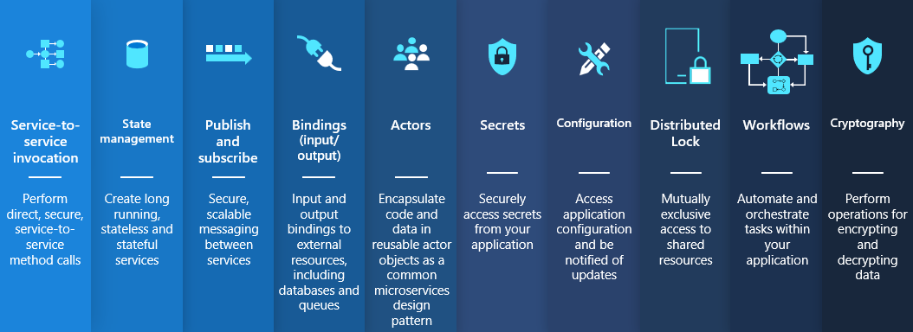
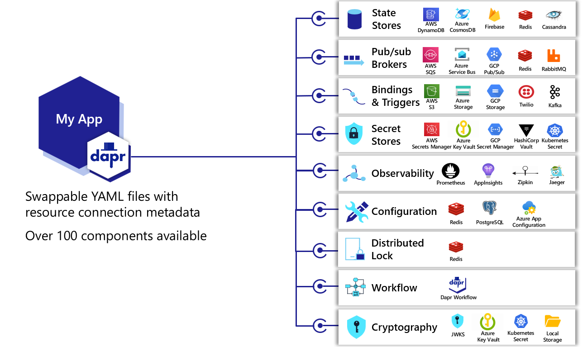

# Bank with Dapr

A Dapr-enabled system that provides the basic banking capabilities you'd expect from your every day banking.

This is a pet project setup for me to learn the basics of coding in Go and leverage the power of [Dapr](https://github.com/dapr) to make it all possible.

## Intro to Dapr

Dapr stands for distributed application runtime. Dapr is designed to make development of distributed systems easy all the while helping developers avoid common pitfalls of distributed systems. Dapr is an opinionated framework that adopts best practices.

Dapr works by providing developers with [building blocks](https://docs.dapr.io/concepts/building-blocks-concept/) as conceptual ideas which they can combine together to build the systems they need.

These building blocks are implemented as [components](https://docs.dapr.io/concepts/components-concept/) which are concrete imlpementations of a building block which leverages YAML to wire up the concept to something usable.

## Dapr usage

This project aims to leverage the following Dapr building blocks:

* PubSub
* State Management
* Actors
* Service invocation
